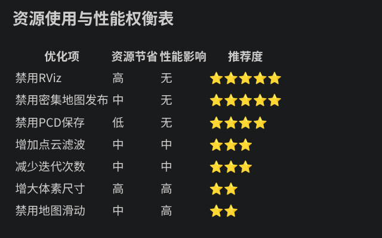

# 新工作空间
## src需要
- fast_livo2源码，名为FAST-LIVO2
- livox_ros_driver2
- rpg_vikit
## 一、基础配置
### 一、安装ivox_SDK2
```bash
git clone https://github.com/Livox-SDK/Livox-SDK2.git
$ cd ./Livox-SDK2/
$ mkdir build
$ cd build
$ cmake .. && make -j
$ sudo make install
```
### 二、FAST-LIVO2依赖
#### 1. 准备其他依赖
1. 安装Sophus
```bash
git clone https://github.com/strasdat/Sophus.git
cd Sophus
git checkout a621ff
mkdir build && cd build && cmake ..
make
sudo make install
```
2. pcl库
网址：`https://developer.aliyun.com/article/1473383`
```bash
# 安装命令1
sudo apt-get install libpcl-dev
# 安装命令2
sudo apt install -y libpcl-dev pcl-tools
# 检查版本
apt-cache show libpcl-dev
```

3. Eigen库
```bash
sudo apt-get install libeigen3-dev
# 检查版本
apt-cache show libeigen3-dev
```

4. openCV
#### 2. 大包依赖
网址：`https://github.com/WilsonGuo/Fast-LIVO2-Drvier-ROS2?tab=readme-ov-file`
```bash
git clone https://github.com/WilsonGuo/Fast-LIVO2-Drvier-ROS2.git
```
- 包括：
  - mvs_ros2_pkg==没用，无需添加==
  - livox_ros_driver2
  - rpg_vikit
==按教程来==
==到现在，src应该有2个包：livox_ros_driver2和rpg_vikit==
### 三、FAST_LIVO2源码
```bash
cd ~/[workspace]/src
git clone https://github.com/Robotic-Developer-Road/FAST-LIVO2.git
```
==现在的src里有3个包：livox_ros_driver2、rpg_vikit、FAST-LIVO2==


## 二、添加文件和修改
### 1. 在FAST_LIVO2目录config目录中添加mid360.yaml配置文件
```yaml
/**:
  ros__parameters:
    common: 
      img_topic: ""  # 清空图像话题
      lid_topic: "/livox/lidar"  
      imu_topic: "/livox/imu"  
      img_en: 0  # 禁用图像
      lidar_en: 1  # 启用LiDAR
      ros_driver_bug_fix: false  

    extrin_calib:
      extrinsic_T: [ -0.011, -0.02329, 0.04412]
      extrinsic_R: [1.0, 0.0, 0.0,
                    0.0, 1.0, 0.0,
                    0.0, 0.0, 1.0]
      Rcl: [-0.00917, -0.99992, 0.00916, -0.01952, -0.00897, -0.99977, 0.99977, -0.00934, -0.01944]
      Pcl: [0.00642, -0.06065, -0.06363]

    time_offset:  
      imu_time_offset: 0.0  # IMU 时间偏移（单位：秒）
      img_time_offset: 0.1  
      exposure_time_init: 0.0 

    preprocess:  
      point_filter_num: 2  # 增加滤波
      filter_size_surf: 0.1  
      lidar_type: 1  
      scan_line: 4  
      blind: 0.5  # 减小盲区

    imu:  
      imu_en: true  
      imu_int_frame: 30  
      acc_cov: 0.3  # 调整
      gyr_cov: 0.2  # 调整
      b_acc_cov: 0.0001  
      b_gyr_cov: 0.0001  

    lio:  
      max_iterations: 5  # 减少迭代
      dept_err: 0.02 
      beam_err: 0.05  
      min_eigen_value: 0.005  
      voxel_size: 0.5 
      max_layer: 4  
      max_points_num: 50  # 减少点数
      layer_init_num: [5, 5, 5, 5, 5]  

    local_map: 
      map_sliding_en: true  # 启用滑动地图
      half_map_size: 50  # 减小地图
      sliding_thresh: 8.0  

    publish:  
      dense_map_en: True 
      pub_effect_point_en: false  # 不发布特征点
      pub_plane_en: false  
      pub_scan_num: 1  
      blind_rgb_points: 0.0  

    pcd_save:  
      pcd_save_en: true  
      colmap_output_en: false  
      filter_size_pcd: 0.15  
      interval: -1  
``` 
### 2. 在FAST_LIVO2中launch目录新建mapping_mid360.launch.py，参考mapping_avia.launch.py修改：
```python
#!/usr/bin/python3
# -- coding: utf-8 --**

import os
from launch import LaunchDescription
from launch.actions import DeclareLaunchArgument, ExecuteProcess
from launch.conditions import IfCondition
from launch.substitutions import LaunchConfiguration
from ament_index_python.packages import get_package_share_directory
from launch_ros.actions import Node

def generate_launch_description():
    
    # Find path
    config_file_dir = os.path.join(get_package_share_directory("fast_livo"), "config")
    rviz_config_file = os.path.join(get_package_share_directory("fast_livo"), "rviz_cfg", "fast_livo2.rviz")

    #这里我们修改加载的雷达参数配置文件：mid360.yaml
    avia_config_cmd = os.path.join(config_file_dir, "mid360.yaml")
    #相机内参配置文件保持不变
    camera_config_cmd = os.path.join(config_file_dir, "camera_pinhole.yaml")

    # 打开 use_rviz
    use_rviz_arg = DeclareLaunchArgument(
        "use_rviz",
        default_value="True",
        description="Whether to launch Rviz2",
    )

    avia_config_arg = DeclareLaunchArgument(
        'avia_params_file',
        default_value=avia_config_cmd,
        description='Full path to the ROS2 parameters file to use for fast_livo2 nodes',
    )

    camera_config_arg = DeclareLaunchArgument(
        'camera_params_file',
        default_value=camera_config_cmd,
        description='Full path to the ROS2 parameters file to use for vikit_ros nodes',
    )

    use_respawn_arg = DeclareLaunchArgument(
        'use_respawn', 
        default_value='True',
        description='Whether to respawn if a node crashes. Applied when composition is disabled.')

    avia_params_file = LaunchConfiguration('avia_params_file')
    camera_params_file = LaunchConfiguration('camera_params_file')
    use_respawn = LaunchConfiguration('use_respawn')

    return LaunchDescription([
        use_rviz_arg,
        avia_config_arg,
        camera_config_arg,
        use_respawn_arg,

        Node(
            package="image_transport",
            executable="republish",
            name="republish",
            arguments=[ 
                'compressed', 
                'raw',
            ],
            remappings=[
                ("in",  "/left_camera/image"), 
                ("out", "/left_camera/image")
            ],
            output="screen",
            respawn=use_respawn,
        ),
        
        Node(
            package="fast_livo",
            executable="fastlivo_mapping",
            name="laserMapping",
            parameters=[
                avia_params_file,
                camera_params_file,
            ],
            output="screen"
        ),

        Node(
            condition=IfCondition(LaunchConfiguration("use_rviz")),
            package="rviz2",
            executable="rviz2",
            name="rviz2",
            arguments=["-d", rviz_config_file],
            output="screen"
        ),
    ])


```
## 三、编译
- 给出两种方法：1、无保错编译，build.sh；2、有保错编译，改CMakeLists.txt可以正常
- ==方法一：无报错==
```bash
cd ~/[workspace]
./src/livox_ros_driver2/build.sh humble
```
- ==方法二：改driver2 CMakeLists.txt==
- 1. 打开livox_ros_driver2/CMakeLists.txt
```bash
# CMakelists.txt第285行
  if(HUMBLE_ROS STREQUAL "humble")
    rosidl_get_typesupport_target(cpp_typesupport_target
    ${LIVOX_INTERFACES} "rosidl_typesupport_cpp")
    target_link_libraries(${PROJECT_NAME} "${cpp_typesupport_target}")
  else()
    set(LIVOX_INTERFACE_TARGET "${LIVOX_INTERFACES}__rosidl_typesupport_cpp")
    add_dependencies(${PROJECT_NAME} ${LIVOX_INTERFACES})
    get_target_property(LIVOX_INTERFACES_INCLUDE_DIRECTORIES ${LIVOX_INTERFACE_TARGET} INTERFACE_INCLUDE_DIRECTORIES)
    #################################### 添加这部分：
    if(NOT LIVOX_INTERFACES_INCLUDE_DIRECTORIES)
      set(LIVOX_INTERFACES_INCLUDE_DIRECTORIES "/usr/local/include")
    endif()
    ########################################
  endif()
```
- 2. 构建
```bash
cd ~/[workspace]
colcon build --symlink-install --continue-on-error
```
==编译报错可以忽略，不放心可以问AI，== 
## 四、运行
```bash
source install/setup.bash

ros2 launch livox_ros_driver2 msg_MID360_launch.py
 # 等待
ros2 launch fast_livo mapping_mid360.launch.py

ros2 launch fast_livo hnurm_nav.launch.py

# 参数指令
ros2 launch fast_livo mapping_mid360.launch.py use_rviz:=true pcd_save.pcd_save_en:=true
```

## 五、未解决：
1. 点云保存？
   - 应该的路径：`/home/robot/fast_lio2_ros2/src/FAST-LIVO2/Log/PCD/all_downsampled_points.pcd`


## 六、节省资源配置
- mid360.yaml
```yaml
publish:
  dense_map_en: false           # 禁用密集地图发布
  pub_effect_point_en: false     # 禁用效果点云发布
  pub_plane_en: false            # 禁用平面发布
  pub_scan_num: 0                # 设置为0不发布扫描数据
  blind_rgb_points: 0.0

pcd_save:
  pcd_save_en: false             # 禁用PCD文件保存

image_save:
  img_save_en: false             # 禁用图像保存

local_map:
  half_map_size: 35              # 减小地图尺寸
  sliding_thresh: 8.0

lio:
  max_iterations: 3              # 减少迭代次数
  voxel_size: 1.0                # 增大体素尺寸
  max_layer: 1                   # 减少层数
  max_points_num: 20             # 减少点数量
```
- Fast-LIVO2会通过以下ROS话题发布里程计数据：
  - /Odometry (nav_msgs/Odometry): 包含位置、姿态和速度信息
  - /path (nav_msgs/Path): 轨迹路径 
  - TF变换: camera_init → aft_mapped
- 测试关闭rviz指令：
```bash
ros2 launch fast_livo mapping_mid360.launch.py use_rviz:=false
```
==总结：==


## 七、输出协方差信息：
### 1. 跟随里程计信息一起输出
  - 修改 LIVMapper.cpp 中的 publish_odometry 函数：
```cpp
void LIVMapper::publish_odometry(const rclcpp::Publisher<nav_msgs::msg::Odometry>::SharedPtr &pubOdomAftMapped)
{
  odomAftMapped.header.frame_id = "camera_init";
  odomAftMapped.child_frame_id = "aft_mapped";
  odomAftMapped.header.stamp = this->node->get_clock()->now();
  set_posestamp(odomAftMapped.pose.pose);

  // 添加协方差信息
  // 从状态协方差矩阵中提取位置和姿态协方差
  // _state.cov 是一个23x23的矩阵，我们需要提取其中的位置和姿态部分
  for(int i = 0; i < 6; i++) {
    for(int j = 0; j < 6; j++) {
      // 位置和姿态在协方差矩阵的前6x6部分
      odomAftMapped.pose.covariance[i*6 + j] = _state.cov(i, j);
      // 速度协方差（假设在7-9行和列）
      if(i < 3 && j < 3) {
        odomAftMapped.twist.covariance[i*6 + j] = _state.cov(i+6, j+6);
      }
    }
  }

  static std::shared_ptr<tf2_ros::TransformBroadcaster> br;
  br = std::make_shared<tf2_ros::TransformBroadcaster>(this->node);
  tf2::Transform transform;
  tf2::Quaternion q;
  transform.setOrigin(tf2::Vector3(_state.pos_end(0), _state.pos_end(1), _state.pos_end(2)));
  q.setW(geoQuat.w);
  q.setX(geoQuat.x);
  q.setY(geoQuat.y);
  q.setZ(geoQuat.z);
  transform.setRotation(q);
  br->sendTransform(geometry_msgs::msg::TransformStamped(createTransformStamped(transform, odomAftMapped.header.stamp, "camera_init", "aft_mapped")));
  pubOdomAftMapped->publish(odomAftMapped);
}
```
### 2.单独设置发布器
- 没必要

## 八、hunrm_fastlio2
==是一个包合集目录==
```
/home/robot/HNU_rm_26_navigaton/src/
└── hnurm_fastlio2/             # 您的包集合目录（不是ROS包）包合集目录
    ├── FAST-LIVO2/             # 算法包（独立ROS包）
    │   ├── CMakeLists.txt
    │   ├── package.xml
    │   └── ...
    ├── livox_ros_driver2/      # 驱动包（独立ROS包）
    │   ├── CMakeLists.txt
    │   ├── package.xml
    │   └── ...
    └── rpg_vikit/              # 视觉工具包集合（内部包含独立ROS包）
        ├── vikit_common/
        │   ├── CMakeLists.txt
        │   ├── package.xml
        │   └── ...
        └── vikit_ros/
            ├── CMakeLists.txt
            ├── package.xml
            └── ...
```

## 九、github
`https://github.com/chen-liu520/HNU_rm_2026_sentry.git`
- ==已经完成==低消耗配置，为hnurm_nav.launch.py，==但是还需要测试==
- ==已完成==编译配置
- ==未完成==协方差信息输出
- ==未完成==点云保存